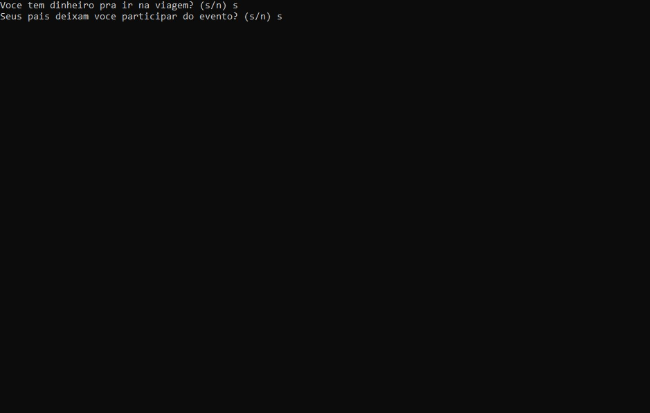

# VAI OU NÃO PARA O EVENTO

<h2>ATIVIDADE</h2>

Atividade para o cliente "s" ou "n" em duas perguntas se as duas resposta forem "s" ele vai para o evento caso o contrário ele não vai.

<h2>Tecnologias</h2>

- C 

- GIT e GitHub 

<h2>Contato</h2>

viktorariel777@gmail.com

